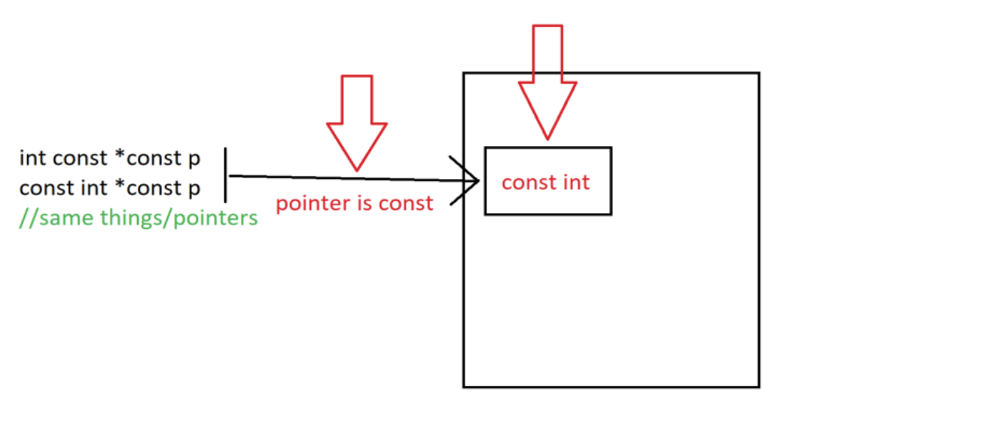
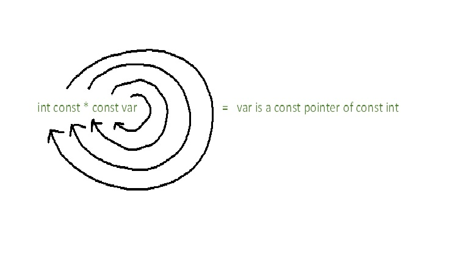

## Указател
Променлива, която пази адрес(memory address) като стойност. <br /> 
Променливата на указател сочи към типа данни, от същия тип, която е и тя, и се създава чрез оператор *. <br /> 
Адресът на променливата, с която работите, се присвоява на указателя. <br /> 

```c++
int number = 5;
int* ptr = &number;// A pointer variable, with the name ptr, that stores the address of number

// Output the value of number
std::cout << number << "\n";

// Output the memory address of number
std::cout << &number << "\n";

// Output the memory address of number with the pointer
std::cout << ptr << "\n";
```

Може да съдържа както адреса на някоя променлива, така и нулев адрес (nullptr) или някоя непозволена памет (което е източник на грешки). <br /> з
Адресът, който съдържа указателят, може да се променя. <br /> 
Може да се извършват промени по данните в съответния адрес. <br /> 
Указателят също притежава адрес. <br /> 

```c++
    //create pointer and set it to address of variable
    bool* engineer = nullptr; 
    bool plane1 = true;
    engineer = &plane1;

    //create another pointer and set it to point to the same address as the first pointer
    bool* gremlin = engineer;

    //decrement the value 
    (*gremlin)--;

    //set the value to true
    *engineer = true;

    //set value
    bool plane2 = *engineer;
    *gremlin = false;

    //set pointer to plane2's address
    gremlin = &plane2;

    //set value
    *engineer = 1;

    //set gremlin's value to opposite of engineer's value
    *gremlin = !(*engineer);
```

### Указатели и масиви

```c++
    int arr[] = {1, 2, 3};
    int* ptr = arr;
```


```c++
    ptr++;
    cout << ptr[0]; //2;
    cout << ptr[1]; //3;
```

 

### Nullptr
- pointer literal(пойнтеров литерал).
- Не може да се вземе адреса му с &.
- nullptr сочи към адрес 0x00000000.

```c++
// function with integer argument
void fun(int N)  { 
    std::cout << "fun(int)\n";
}

// Overloaded function with char pointer argument
void fun(char* s) {
    std::cout << "fun(char*)\n";
}

int main() {
    fun(NULL);
}
//call of overloaded 'fun(NULL)' is ambiguous
```

### Указатели към константи/Константни указатели
Указателите към константа – НЕ може да се променя стойността на променливата, към която сочат.
- const int* - указател към константа
- int const* - указател към константа


Константните указатели са като референциите, но са указатели.
Може да се променя стойността на променливата, но НЕ може да се променя да сочи към друга променлива.
- int* const – константен указател



### Spiral Rule - Bjarne Stroustrup
Правилото гласи, започнете от името на променливата и се придвижваме по посока на часовниковата стрелка до следващия указател или тип.



```c++
const int * const == int const * const – константен пойнтър към константа

( int *) * const – константен пойнтър към пойнтър от тип int

( (int ) * const )* - пойнтър към константен пойнтър към int

( ( int const ) *) * - двоен пойнтър към константа от тип int

( ( int ) * const ) * const – константен пойнтър към константен пойнтър към int

( ( const int ) * const ) * const – константен пойнтър към константен пойнтър към константа от тип int
```

## Символен низ
Символен низ наричаме **последователност от символи**.
Последователност от 0 символи наричаме **празен низ**.
Представяне в C++ - масив от символи (char), който завършва със символа **'\0'**.

```c++
    char word[] = { 'H', 'e', 'l', 'l', 'o', '\0' };
    char word[6] = { 'H', 'e', 'l', 'l', 'o' }; //обикновен масив от символи
    char word[5] = { 'H', 'e', 'l', 'l', 'o' }; //обикновен масив от символи
    char word[100] = "Hello";
    char word[5] = "Hello"; //невалидно, понеже " "включват в себе си '\0‘
    char word[6] = "Hello";
```

### Tерминираща нула - \0
Първият символ в ASCII таблицата, с код 0 – т.е **char(0)**.
Брои се като елемент и **влияе** на размера на масив.
Използва се като **прекъсвач (терминатор)** от много функции за символни низове, за да се определя края на низа.

```c++
    //Може да се сложи в средата на масив от символи
    char a []= {'H', 'e', 'l', 'l','\0', 'o'}; //символният низ е “Hell”
```

## Как изглежда в паметта

```c++
    char str[] = {'t', 'e', 's', 't', '\0'};
    char str2[] = "test"; //equivalent to str
    char str3[7] = "test"; 
```


Пояснение: В информатиката под **литерал** се разбира константна стойност на променлива, зададена в сорс кода на дадена компютърна програма.

### Инициализация

```c++
    //Чрез инициализатор
    char text[16] = {'C','+','+', '\0'};
    char sameText[] = {'C','+','+', '\0'};

    //Чрез литерал
    char sameTextAgain[] = "C++";
    char sameTextYetAgain[16] = "C++";
```

### Четене и писане от/в конзолата

``std::cout <<`` принтира до терминираща нула, ако такава липсва в низа - продължава докато не намери!

#### Четене с ``cin >>``

Чете форматиран input

т.е. пропуска/чете до:
    - табулация
    - спейс
    - нов ред

```c++
#include<iostream>

int main() {
    char buffer[24];
    std::cin >> buffer; // Hello, world!
    std::cout << buffer << std::endl; // Hello, 
}
```

#### Четене с ``cin.getline``

Четене без да пропуска ws/табулации/нови редове

```c++
std::cin.getline(char[] buffer, size_t count, char delimeter);
```
 
Където:

- buffer - алокирана памет, където да записва прочетеното

- count - колко байта да прочете от конзолата
    
- delimeter - до срещането на какъв символ да чете (има стойност по подразбиране - newline character - '\n')

```c++
#include<iostream>
// 13 characters + 1 - '\0' character
const int BUFFER_SIZE = 13 + 1;

int main() {
    char buffer[BUFFER_SIZE];
    std::cin.getline(buffer, BUFFER_SIZE); // Hello, world!
    std::cout << buffer << std::endl; // Hello, world!
}
```

Note:
След четене с ``cin >>`` остават табулации/ws/newline character в потока.
Следователно последващо чете със cin.getline ще прочете тези символи.


## Примери:
1. Напишете имплементация на **strlen** - *връща колко символа има от началото до ‘\0’*

2. Напишете имплементация на **strcmp** - *сравнява 2 символни низа (> , = , <)*

3. Напишете имплементация на **strcpy** - *копира source в destination*

4. Напишете имплементация на **strcat** - *конкатенация*

5. Напишете имплементация на **аtoi** - *преобразуване на стринг в число*

6. Напишете имплементация на **searchInText** - *търсене в текст*.

7. Напишете импелментация на **getCharOccurrencesCount** - *брой срещания на кнокретен символ в текст*.


**Задача 1:** Напишете функция, която приема 3 стринга - text, where и what и замества в text всяко срещане на where с what.

*Да се реши без допълнителна памет (in-place).*

*Вход: "I am the best of the best", "best" , "worst" , Изход: "I am the worst of the worst"*

**Задача 2** Напишете функции toUpper и toLower, които приемат стринг и променят всички главни букви в малки/всички малки букви в главни.

**Задача 3** Напишете функция, която приема стринг и връща броя на думите в него. (Думите са разделени с произволен брой интервали, табулации и препинателни знаци)

*Вход: "Me? Why always me?, Изход: 4*


**Задача 4** Напишете функция, която приема стринг и връща най-често срещаната дума.(Думите са разделени с произволен брой интервали, табулации и препинателни знаци). Игнорираме разликата между главни и малки букви за задачата.

*Вход: "Me? Why always me?, Изход: me*

**Задача 5** Напишете функция, която приема стринг и връща лексикографско най-малка дума.

*Вход: "Me? Why always me?, Изход: always*
